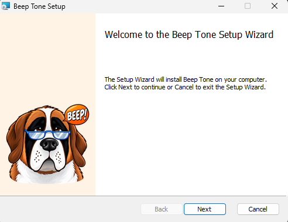
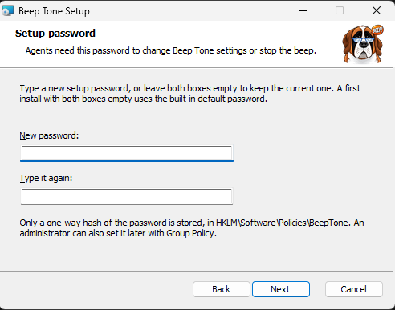
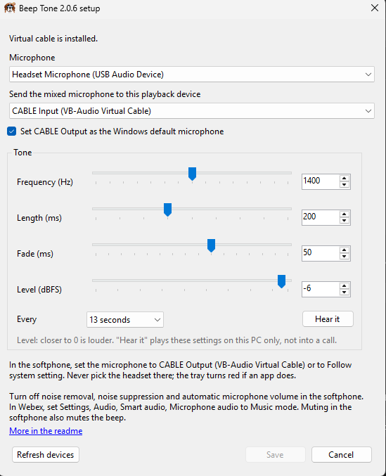
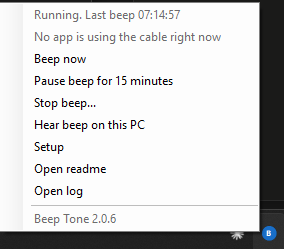

<p align="center">
  
</p>

# Beep Tone Injector

A Windows tray app that mixes a recording beep into the microphone and sends that mix to a virtual audio cable. The softphone uses the cable as its microphone, so the remote party and the recording hear the beep.

It does not record the call. It does not decide whether a beep is required.

**[Download the latest release](https://github.com/IWSGroup/beep-tone-injector/releases/latest)** (`BeepTone.msi`)

## Check the phone system first

If the phone system can play the tone itself, use that instead of this app, or keep this app only as a backup. Webex Calling has a **Recording Reminder Tone** in Control Hub (user, Calling, Call recording) that repeats every chosen number of seconds and can play to internal users, external callers, or both. Many recording platforms have the same option.

A tone from the phone system covers things this app cannot:

- Muting in the softphone mutes this beep too, but the other party is still recorded.
- Calls on a desk phone, a mobile, or a VDI session with Webex media offload never pass through this PC's microphone.
- Softphone noise removal and automatic gain can weaken or remove a tone mixed into the microphone.

Whichever way the tone is added, `BeepToneCtl.exe check-recordings` (below) checks the recordings themselves.

## Start fresh: remove the PowerShell version

Earlier versions were a PowerShell script, `BeepTone.ps1`. The installer removes its scheduled tasks, stops any running copy, and deletes its compiled files on its own. It keeps each user's `config.json`, because this version reads the same file. To remove everything and start clean instead, run these in an administrator PowerShell before installing:

```powershell
Get-ScheduledTask -TaskName 'BeepTone*' -ErrorAction SilentlyContinue | Unregister-ScheduledTask -Confirm:$false
```

```powershell
Get-CimInstance Win32_Process -Filter "Name = 'powershell.exe'" | Where-Object { $_.CommandLine -match 'BeepTone\.ps1' } | ForEach-Object { Stop-Process -Id $_.ProcessId -Force }
```

```powershell
Get-ChildItem 'C:\Users\*\AppData\Local\BeepTone' -Directory -ErrorAction SilentlyContinue | Remove-Item -Recurse -Force
```

```powershell
Remove-ItemProperty -Path 'HKLM:\Software\BeepTone' -Name 'Disabled' -ErrorAction SilentlyContinue
```

In order, these remove every user's BeepTone scheduled tasks, end any running `BeepTone.ps1`, delete every user's settings, logs and compiled files, and clear the administrator stop flag. Run them in that order, so a watchdog task cannot restart the script. Skip the third one to keep each agent's saved microphone and tone. Skip the fourth one if an administrator stopped the beep on purpose and it should stay off.

Then delete the folder that holds `BeepTone.ps1`.

The PowerShell version made CABLE Output the Windows default microphone. If you are not installing this version, set the default back to the headset in Sound settings and check the softphone's microphone, because CABLE Output is silent without the app. Leave VB-Cable installed if you are moving to this version.

## Install

Download `BeepTone.msi` from the [latest release](https://github.com/IWSGroup/beep-tone-injector/releases/latest). It installs for every user on the PC. Opened by hand, it walks through Welcome, **Setup password**, **Virtual cable**, and Install. The **Virtual cable** page has two boxes, both ticked: install VB-Cable if it is missing, and remove VB-Cable when Beep Tone is uninstalled.

<p align="center">
  
  &nbsp;
  
</p>
 On the password page, type a new setup password twice, or leave both boxes empty to keep the current one (a first install then uses the built-in default). Only a one-way hash of the password is stored.

To install without any prompts, for example from Intune or SCCM:

```powershell
msiexec /i BeepTone.msi /qn
```

It installs to `C:\Program Files\BeepTone`, where standard users cannot change it:

- `BeepTone.exe`, the tray app that mixes the beep.
- `BeepToneCtl.exe`, which is both the **Beep Tone Guard** service and the command-line tool.
- `README.md`, opened from the tray.

The guard service runs as LocalSystem and checks every signed-in session every 5 seconds. It starts `BeepTone.exe` when it is missing and restarts it when it hangs or stops beeping. A standard user cannot stop the service. The installer also registers the `BeepTone` event log source.

Tone settings can be set from the install command line. Each value you pass is written to the policy key (below) and greyed out in setup:

```powershell
msiexec /i BeepTone.msi /qn LEVELDBFS=-30 INTERVALSECONDS=13 ALLOWPAUSE=0
```

| Property | Policy value | Meaning |
|---|---|---|
| `FREQUENCYHZ` | `FrequencyHz` | 1260-1540 |
| `DURATIONMS` | `DurationMs` | 170-250 |
| `INTERVALSECONDS` | `IntervalSeconds` | 12-15 |
| `RAMPMS` | `RampMs` | 5-80 |
| `LEVELDBFS` | `LevelDbfs` | -90 to -3 |
| `SETDEFAULTMICROPHONE` | `SetDefaultMicrophone` | 1 keeps CABLE Output as the default microphone, 0 leaves it alone |
| `ALLOWPAUSE` | `AllowPause` | 0 removes the pause option |
| `PAUSEMINUTES` | `PauseMinutes` | 1-60 |
| `ALLOWSTOP` | `AllowStop` | 0 removes **Stop beep** from the tray |
| `IGNOREDMICAPPS` | `IgnoredMicApps` | Comma-separated apps allowed to use the physical microphone |
| `SETUPPASSWORD` | `SetupPasswordHash` | A new setup password. The installer stores only its hash |
| `SETUPPASSWORDHASH` | `SetupPasswordHash` | A hash from `BeepToneCtl.exe new-password-hash`, so the password never appears in a command line |
| `CABLEPACKURL` | `CablePackUrl` | Where to download VB-Cable from, for example an internal file share or web server |
| `INSTALLVBCABLE` | (none) | 0 skips installing VB-Cable |
| `REMOVEVBCABLE` | (none) | 0 keeps VB-Cable when Beep Tone is uninstalled. Remembered from install (the wizard's second box sets it too), and can also be given to the uninstall |

Upgrades and reinstalls need no preparation. When the installer asks Beep Tone to close, every tray app closes at once, so there is no "files in use" prompt, wait, or restart. The installer then stops the guard, replaces the files, and starts the guard again, which brings the tray back for every signed-in user. There is deliberately no Exit on the tray; **Stop beep** turns the beep off.

Pass the same properties again when installing a newer version, because an upgrade replaces them. The setup password is the exception: an upgrade keeps the current one unless a new one is given.

The installer does not clear an administrator stop (below), so a stop survives upgrades. If one is set, the beep stays off after install and the tray shows a grey icon. The install log (`msiexec /i BeepTone.msi /l*v install.log`) and the Application event log both say so. Run `BeepToneCtl.exe start` to turn it on.

**VB-Cable.** When VB-Cable is not installed, the MSI downloads it from VB-Audio at the end of the install, checks that VB-Audio signed the installer, and installs it silently. The MSI does not carry VB-Cable inside it, because the driver is VB-Audio's to distribute; check their licence terms for business use. This step never fails the Beep Tone install. If the PC cannot reach vb-audio.com, the signature does not match, or the VB-Cable installer does not finish within 5 minutes, the install log and the Application event log (ID 1601) say so, and the tray reports the missing cable. On a PC that cannot reach the internet, set `CABLEPACKURL` to a copy of `VBCABLE_Driver_Pack45.zip` on your network, or install VB-Cable with your deployment tool first and the MSI will skip it. Occasionally Windows needs a restart before a newly installed CABLE Input appears. `INSTALLVBCABLE=0` skips this step. The tray's **Setup** window also offers **Install Virtual Cable** on a PC without it.

The MSI is not code-signed. Deployment through Intune, SCCM or the methods above works as normal. Opening it by hand shows "Unknown publisher". If you use Windows Defender Application Control, allow the three files by hash.

## Deploy to many PCs

The MSI installs silently from any tool that can run `msiexec` as an administrator or as SYSTEM. It needs no user present and no restart. Exit code 0 means installed, 3010 means installed but a restart is pending, 1618 means another install was running (try again), and anything else is a failure; add `/l*v <file>` for a log.

- **Intune**: add it as a Windows line-of-business app and put the properties in the command-line arguments, for example `LEVELDBFS=-30 SETUPPASSWORDHASH=pbkdf2-sha256$...`.
- **Configuration Manager**: create an application with the install command `msiexec /i BeepTone.msi /qn /norestart` plus any properties, and the uninstall command `msiexec /x {product code} /qn /norestart`. Exit code 3010 from the uninstall means a restart finishes removing VB-Cable.
- **Group Policy software installation**: assign the MSI to computers. It passes properties only through a transform (.mst) file, so it is simpler to set the tone and password with Group Policy Preferences registry items under `HKLM\Software\Policies\BeepTone` instead.
- **PowerShell remoting**, from an administrator prompt. Copy the MSI to each PC first, because a remote session usually cannot read a network share (the Windows double-hop sign-in limit):

```powershell
$pcs = 'AGENT-PC01', 'AGENT-PC02'
```

```powershell
foreach ($pc in $pcs) { Copy-Item .\BeepTone.msi "\\$pc\C$\Windows\Temp\" }
```

```powershell
Invoke-Command -ComputerName $pcs { (Start-Process msiexec.exe -ArgumentList '/i C:\Windows\Temp\BeepTone.msi /qn /norestart /l*v C:\Windows\Temp\BeepTone-install.log' -Wait -PassThru).ExitCode }
```

Prefer `SETUPPASSWORDHASH` over `SETUPPASSWORD` in deployment tools, because tools often record their command lines. Make a hash once on any PC with Beep Tone installed with `BeepToneCtl.exe new-password-hash`.

The MSI installs VB-Cable too when it is missing (see Install). To deploy VB-Cable yourself instead, use its silent installer (`VBCABLE_Setup_x64.exe -i -h`) before Beep Tone, or pass `INSTALLVBCABLE=0`. Uninstalling Beep Tone removes VB-Cable whoever installed it, so also pass `REMOVEVBCABLE=0` if other software on the PC needs it.

## Set up each agent

After install, the beep starts at sign-in with no prompt. It picks the microphone automatically (a headset first). To choose a specific microphone or change the tone, right-click the tray icon and choose **Setup**. Anyone can open it and look; the setup password is asked for only when saving a change.

<p align="center">
  
</p>

1. Choose the physical microphone. Virtual devices are not offered, so the mix cannot loop.
2. Set the tone frequency, length, fade, and level with the sliders, or type an exact value in the box next to each one. Pick the spacing from the list. Settings set by policy are greyed out. **Hear it** plays the current settings on this PC only, before saving.
3. Leave **Set CABLE Output as the Windows default microphone** checked. That sets the normal Windows input, the multimedia input, and the communications input to CABLE Output.
4. Click **Save** and enter the setup password. **Save** stays greyed out until something changes.

In the softphone, set the microphone to **CABLE Output (VB-Audio Virtual Cable)**, or to **Follow system setting**. Do not select the physical microphone there. If an app records from the physical microphone directly, the tray turns red and names the app.

Headphones avoid the speaker feeding back into the microphone. The mixer adds about 50 ms of delay.

## Tone

- 1400 Hz, limited to 1260-1540
- 200 ms long, limited to 170-250, with a 50 ms fade at each end so it eases in instead of popping
- Repeats 13 seconds after the previous beep starts, limited to every 12-15 seconds
- Level is the fixed dBFS value from setup, from -90 to -3. Closer to 0 is louder. It does not rise and fall with other audio on the call.

Setup saves these in `%LOCALAPPDATA%\BeepTone\config.json`, unless policy sets them. Values outside these ranges are pulled back in, including values typed into `config.json` by hand. The beep is timed from the audio clock, so it does not drift over a long shift. The first beep plays as soon as the mixer starts. A beep that has started always finishes, so pausing or **Beep now** never cuts it off with a click.

The mix uses only the local microphone. The other person's voice is not mixed back in, because that would echo them to themselves.

## Softphone audio processing

The beep is a tone inside the microphone signal. Noise removal, noise suppression, and automatic microphone volume treat that tone as noise. They make it louder, quieter, or drop it out as the other audio on the call changes.

In Webex, set Settings, Audio, Smart audio, Microphone audio to **Music mode**. Leave Noise removal, Optimize for my voice, and Optimize for all voices off. Also turn off automatic microphone volume if that option is shown.

Any other softphone needs the same thing. Turn off noise removal, noise suppression, and automatic gain on the microphone that receives the cable.

## Tray

<p align="center">
  
</p>

The icon has no Quit. It turns amber for a moment each time a beep is sent, red while the beep is not going out or is paused, and grey while an administrator has the beep stopped. A red banner at the top of the screen says what is wrong. It does not take focus, can be hidden for 2 minutes, and appears even when Windows notifications are silenced. A notification also names the problem and repeats about every two minutes until the beep returns.

The menu shows the status, which apps are using the cable, **Beep now**, **Pause beep for 15 minutes**, **Stop beep**, **Hear beep on this PC**, **Setup**, **Open readme**, and **Open log**, then the installed version. The setup window's title shows the version too. **Setup** opens for anyone and asks for the password only when saving a change.

**Pause beep for 15 minutes** stops only the tone. The microphone keeps working. The icon stays red and an amber banner shows when the beep will return. After 15 minutes the beep turns itself back on with a beep. **Turn beep on** ends the pause sooner. No password is required. Policy can change the length or turn pausing off. Every pause is logged. A pause file edited to last longer than one pause is removed and reported.

**Stop beep** asks for the setup password, then turns the beep off and closes the microphone until someone chooses **Start beep**, which needs no password. The stop is kept only while the tray runs, so it also ends at sign-out or restart, and it cannot be set by editing a file. The icon turns grey and an amber banner shows while it is stopped. Every stop and start goes to the event log. Policy `AllowStop` = 0 removes the option.

While an administrator has the beep stopped, the menu shows **Turn beep on (administrator)...** instead of **Stop beep**. It runs `BeepToneCtl.exe start` behind the Windows approval prompt, so only an administrator can use it.

**Beep now** plays the tone into the call. **Hear beep on this PC** plays the same tone through this computer's speakers or headset so the level can be checked, and does not send it into the call.

Muting in the softphone mutes the beep, because the beep is part of the microphone signal the softphone receives. Muting CABLE Output in Windows, for example with a keyboard mute key, does the same, and the tray reports it. Muting the physical microphone in Windows or on the headset silences the voice but not the beep.

## What it checks while running

- **The beep reaches the cable.** The mixer listens on CABLE Output and checks each beep at the set level. If two beeps in a row do not arrive, the tray turns red. The log records the level heard for every beep.
- **No app skips the cable.** Every 2 seconds it looks for apps recording from a physical microphone. Calls in such an app have no beep, so the tray turns red and names the app. The Windows Sound control panel and Settings are ignored, because they open every microphone for their level meters. Policy `IgnoredMicApps` adds others.
- **The cable is not muted.** A muted CABLE Input or CABLE Output in Windows is reported.
- **Default devices.** About every 15 seconds, and as soon as Windows changes a default, it sets CABLE Output back as the default microphone (when enabled). It also makes sure the cable Beep Tone plays into (CABLE Input) is not the default speaker, which would send the other party's voice back into the call. Any other speaker you choose, including other virtual devices such as VoiceMeeter, is left alone. Both are skipped during Remote Desktop.
- **The saved microphone.** If it is unplugged, the mixer uses a headset, then the Windows default, then any other physical microphone. It switches back as soon as the saved one is connected again. A fallback is never saved as the new choice. Devices are matched by their Windows ID and then by name, so plugging the same headset into another port still works.
- **The microphone is still sending.** If no audio arrives for a second, the mixer reopens the devices.

## Keeping it running

The mixer waits on the audio device instead of polling, runs with multimedia scheduling priority, and opts out of Windows background power throttling. It corrects for the small speed difference between the microphone's clock and the cable's, so delay stays steady instead of creeping up and then dropping speech. It writes a heartbeat every second with the time of the last beep and its state (running, paused, reconnecting, stopped). If the audio thread stops responding for 20 seconds, the tray app exits so the guard restarts it.

The guard starts the tray app if it is gone. It restarts it if the heartbeat is more than 30 seconds old (checked twice, a few seconds apart, so waking from sleep does not trigger it), or if it has run for 90 seconds in the running state without a beep for about two intervals. It does not restart a tray app that is paused or waiting for a missing device, because a restart would not help. It backs off for 10 minutes after 5 starts in 10 minutes. It wakes at once when someone signs in or unlocks.

An administrator can force the beep to stay off:

```powershell
& 'C:\Program Files\BeepTone\BeepToneCtl.exe' stop
```

```powershell
& 'C:\Program Files\BeepTone\BeepToneCtl.exe' start
```

`stop` asks Windows to elevate and sets `HKLM\Software\BeepTone\Disabled`. Within a second every tray app stops the beep, closes the microphone, and turns grey with "Beep stopped by an administrator". It stays that way, including after the next sign-in, until an administrator runs `start`. A standard user who cancels the approval prompt does not stop the beep. After `start`, every tray app starts beeping again within a second, with no sign-out needed.

## Policy

Values under `HKLM\Software\Policies\BeepTone` override setup and are greyed out there. Set them with the MSI properties above, Group Policy Preferences, or Intune. Numbers can be DWORD or string values.

| Value | Meaning |
|---|---|
| `FrequencyHz`, `DurationMs`, `IntervalSeconds`, `RampMs` | Tone settings, limited to the ranges above |
| `LevelDbfs` | Tone level, for example `-30` |
| `SetDefaultMicrophone` | 1 keeps CABLE Output as the default microphone, 0 leaves it alone |
| `AllowPause` | 0 removes the pause option |
| `PauseMinutes` | Pause length, 1-60 minutes |
| `AllowStop` | 0 removes **Stop beep** from the tray |
| `IgnoredMicApps` | Apps allowed to use the physical microphone, for example `SpeechRuntime.exe` |
| `SetupPasswordHash` | Setup password hash from `BeepToneCtl.exe new-password-hash` |
| `CablePackUrl` | VB-Cable package the installer and the Setup button download |
| `CableSignerPattern` | Pattern the VB-Cable installer's signer must match |

## Checking recordings

```powershell
& 'C:\Program Files\BeepTone\BeepToneCtl.exe' check-recordings 'D:\Recordings' --recurse --csv report.csv
```

This reads each WAV, MP3, M4A (AAC) or WMA recording, any sample rate or channel count, and finds the beeps. A beep counts anywhere in the allowed 1260-1540 Hz, so beeps from a hardware beep device or another app are found as well as Beep Tone's; the **BeepHz** column shows the frequency found. `--frequency 1400` counts only beeps within 40 Hz of 1400 Hz. WAV files (PCM, float, mu-law or A-law) are read directly; the other formats use the decoders built into Windows, which Windows "N" editions get from the Media Feature Pack. A recording passes when no stretch is longer than `--max-gap` seconds (default 18) without a beep, counting from the start and to the end. A call shorter than that can pass with no beep. The exit code is 1 if any recording fails, so a nightly job can alert on it. A file that is not a readable recording is listed as ERROR, and the rest are still checked. `--csv` writes the same table as a spreadsheet; a bare file name such as `report.csv` is saved in the folder the command was run from, and the command prints the full path.

## Other commands

Run `BeepToneCtl.exe` from `C:\Program Files\BeepTone`:

| Command | What it does |
|---|---|
| `selftest` | Checks the tone, the schedule, clock-drift correction, recovery from a microphone stall, beep detection under speech, the recording checker, the heartbeat and guard rules, the setting limits, the pause-file check, and the password hash. Needs no audio devices. |
| `list-devices` | Lists microphones and playback devices. |
| `test-mix --seconds 40` | Runs the real mixer without changing default devices, and reports whether every beep was heard on the cable. It opens the microphone while it runs. |
| `guard-check` | Shows what the guard would do for this session, without doing it. |
| `cleanup-legacy` | From an administrator prompt: removes the PowerShell version's tasks, running script and compiled files. |
| `new-password-hash` | Makes a setup password hash for policy. |
| `version` | Shows the installed version. |
| `install-cable-if-missing` | From an administrator prompt: installs VB-Cable if it is missing, the same way the installer does. `--dry-run` downloads it and checks the signature without installing. |
| `remove-cable` | From an administrator prompt: removes VB-Cable (its device, CABLE Input and CABLE Output, and its driver), the same way uninstalling does. `--dry-run` lists what it would remove. VoiceMeeter and VB-Cable A/B are not touched. Exits with 3010 when a restart finishes the removal. |

## Uninstall

```powershell
msiexec /x BeepTone.msi /qn /norestart
```

This stops the guard, ends every tray app, and removes the files, the service, any policy values the MSI wrote, and VB-Cable. Windows then picks another default microphone; check that it is the headset, and check the softphone's microphone setting. Upgrading to a newer Beep Tone never removes VB-Cable. Each user's settings and logs are left behind.

Uninstalling from **Installed apps** asks **Also remove VB-Cable?** when it is installed. **Yes** is the default unless the second box on the install wizard's **Virtual cable** page was unticked.

When an app such as the softphone still has CABLE Output open, Windows finishes removing VB-Cable only at the next restart, and it still shows in Sound settings until then. The uninstaller then asks to restart. A silent uninstall never restarts the PC by itself: with `/norestart` it returns exit code 3010 so your deployment tool can schedule the restart, and without it the removal finishes at the next restart. Event 1602 in the Application log says when a restart is pending.

To keep VB-Cable, for example because other software uses it, answer **No**, or pass `REMOVEVBCABLE=0` to the uninstall, or to the install so that uninstalling from Installed apps defaults to keeping it:

```powershell
msiexec /x BeepTone.msi /qn /norestart REMOVEVBCABLE=0
```

If CABLE Output is still the default microphone after VB-Cable is kept, set it back to the headset in Sound settings, because it is silent without the app.

Versions before 2.0.10 left VB-Cable installed. To remove it from a PC that had one of those uninstalled, remove **VB-Audio Virtual Cable** under **Sound, video and game controllers** in Device Manager (tick **Attempt to remove the driver for this device**), or run VB-Cable's installer and choose **Remove Driver**.

## Files

Settings, the log and the heartbeat are in `%LOCALAPPDATA%\BeepTone\` for each user. When `beep-tone.log` passes 512 KB it is renamed to `beep-tone-YYYYMMDD-HHMMSS.log` and a new log starts. Only the seven newest archives are kept. Every 10 minutes the log records audio stats: delay range, clock correction, underruns, trims and capture glitches. `config.json` can name a different playback device, such as a VoiceMeeter input, by changing `renderDeviceName`.

Events also go to the Windows Application log under source `BeepTone`, so they can be collected centrally:

| ID | Event |
|---|---|
| 1000 | Beep or guard started |
| 1001, 1002 | Administrator stop, start |
| 1100, 1101 | Beep problem, cleared |
| 1200, 1201 | Paused, pause ended |
| 1202 | Pause file edited to last longer than one pause |
| 1203, 1204 | Stopped with **Stop beep**, started with **Start beep** |
| 1300, 1301 | An app is using the physical microphone directly, cleared |
| 1400 | Settings saved |
| 1500, 1501, 1502 | Guard started, restarted, or is backing off from the tray app |
| 1600, 1601 | VB-Cable installed by the installer, or could not be installed |
| 1602, 1603 | VB-Cable removed by the uninstaller, or could not be fully removed |

## Building

Needs the .NET SDK (6 or later) on Windows. The .NET Framework 4.8 targeting pack comes with Visual Studio, or the SDK downloads it. WiX 5 comes from NuGet on the first build.

```powershell
.\build.ps1
```

The program icon and installer artwork are made from `assets/app-icon.png`. After changing that image, run `python assets/make_icons.py` (needs Python with Pillow) and commit the files it writes. The tray keeps its coloured "B" icons, because their colour shows the beep's status.

To release a new version, raise `Version` in `Directory.Build.props` first, so the MSI upgrades installed copies. The build makes `BeepTone.exe` and `BeepToneCtl.exe` for .NET Framework 4.8, which is part of Windows 10 and 11, then `dist\BeepTone.msi`, and runs the self-test. The source is in `src\Shared` (audio engine and settings), `src\BeepTone` (tray app), `src\BeepToneCtl` (service and commands) and `installer` (MSI).
